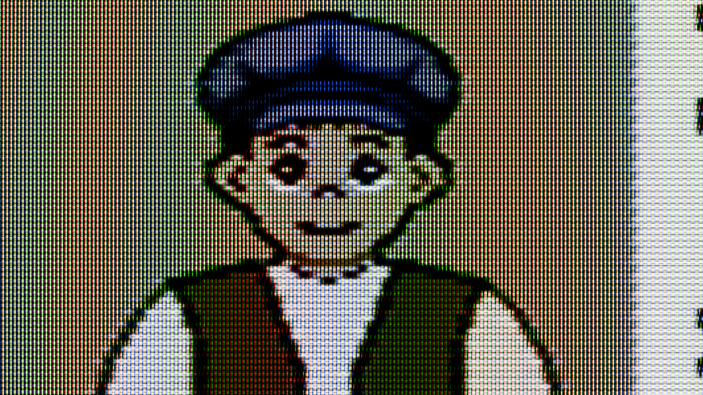

# TV CRT Emulator

##### Original Subpixel display examples by Thomas Radeke

##### Modified by Persune 2023

------

This project is modified specifically for TV CRTs to be more accurate. This project is designed to be rendered in Cycles and Eevee. Currently, a detailed guide is not yet available.


Image above rendered in Cycles.


Image above rendered in Eevee.

------

Included in this repository are two different shadowmasks ("inline" and "trinitron"), some example screenshots of PinoBatch's 240p Test Suite, a full palette ROM demo from Mesen using blargg's NTSC filter (https://wiki.nesdev.com/w/index.php/Full_palette_demo), a test ROM screen by [@yoeynsf](https://github.com/yoeynsf), and corresponding example renders at 1920x1080p.

Due to shifting standards and CRT technology evolving from analog 50's tech to somewhat digital control technology, each CRT TV varies in how it interprets and displays video signals. I encourage to adjust the settings to taste.

The input image must be filtered or preprocessed to have composite/analog video artifacts, or if desired, left unmodified to emulate a high quality RGB signal.


The resulting image may have too much high frequency details to be viewed downscaled. If the downscaled image appears to be slightly dim, try adjusting the focus until the phosphor dots are blurry enough to overlap and blend with each other a bit.

### Directly focused on phosphor dots:



### Slightly unfocused in front of the phosphor dots:


The layout of the material shader is shown:


The original description is preserved below for reading.

```
Subpixel display examples
by Thomas Radeke
for the Blender Conference 2015
-------------------------------
http://www.rahdick.at
===============================

This scene shows three simple PC-CRT, LCD and TV-CRT subpixel setups.
The default workspace has cameras set up - try rendering them individually.

The TV-CRT example clearly has problems with every second pixel column
being shifted half a row - for this, the source image has to be shifted
accordingly.

This material is released under a Creative Commons Attribution 4.0 license.
http://creativecommons.org/licenses/by/4.0/
```

